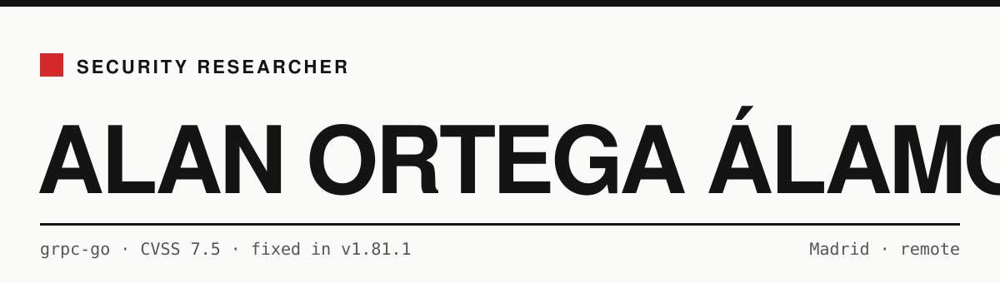

<picture>
  <source media="(prefers-color-scheme: dark)" srcset="assets/banner-dark.svg">
  
</picture>

Self-taught security researcher. I look for vulnerabilities in widely used software and disclose them responsibly.
Open to junior roles in **application security, vulnerability research or security engineering** — Madrid or remote.

[Website](https://al4an444.github.io) · [LinkedIn](https://linkedin.com/in/alan-o-b70724290) · [Instagram](https://www.instagram.com/_.alaaan._5/) · [alanortega7312@gmail.com](mailto:alanortega7312@gmail.com)

## Findings

| | Vendor | Finding | Severity | Status |
|---|---|---|---|---|
| 01 | **Google** · grpc-go | Authentication bypass in the xDS RBAC engine: the authenticated-principal matcher fell through from URI/DNS SANs to the certificate's Subject DN. Credited in the release notes. | CVSS 7.5 | Fixed · [v1.81.1](https://github.com/grpc/grpc-go/releases/tag/v1.81.1) · [PR #9111](https://github.com/grpc/grpc-go/pull/9111) |
| 02 | **Google** · protobuf-go | `prototext` recursion limit bypassed on the unknown-field skip path, crashing the process with an unrecoverable stack overflow. Reported it and authored the fix. | Denial of service | Merged · [CL 774741](https://go-review.googlesource.com/c/protobuf/+/774741) |
| 03 | **Microsoft** · Azure msi-acrpull | The ACR server field of an `AcrPullBinding` was not restricted to trusted registry domains, so the controller could send its Azure (ARM) bearer token to an attacker-controlled endpoint. Confirmed by MSRC. | Important · Information disclosure | Fixed · [PR #129](https://github.com/Azure/msi-acrpull/pull/129) |
| 04 | **NVIDIA** · PSIRT | — | High | Reproduced · under review |

Open reports stay at vendor, severity and status until the vendor publishes.

**Case study — ZeroLogon (CVE-2020-1472).** My vocational school's domain controller was missing the August 2020 updates. I demonstrated the impact, stopped at proof, kept no data, reported it and helped remediate. [Read the writeup →](https://al4an444.github.io/research/zerologon-domain-compromise/)

## Built

| Project | What it does | Stack |
|---|---|---|
| [**phishguard**](https://github.com/al4an444/phishguard) | Explainable phishing detection for URLs and e-mails: heuristic rules plus an ML model, CLI, REST API and web UI. Everything runs locally. | Python · FastAPI · scikit-learn |
| [**ghosttalk**](https://github.com/al4an444/ghosttalk) | End-to-end encrypted, zero-knowledge chat. | TypeScript · React · Supabase · Web Crypto API |
| [**shutdown-restore**](https://github.com/al4an444/shutdown-restore) | Windows service that creates a restore point on every shutdown, bypassing the 24 h limit and rotating old backups. | C++ · Windows services |

## Education & certifications

- **HND in Network & Systems Administration (ASIR)** — ILERNA Online · 2025–2027, in progress
- **Vocational degree in Microcomputer Systems & Networks (SMR)** — 2023–2025
- **Introduction to the Threat Landscape 3.0** — Fortinet Training Institute · Apr 2026
- **Introduction to Cybersecurity** — Cisco Networking Academy · Apr 2026
